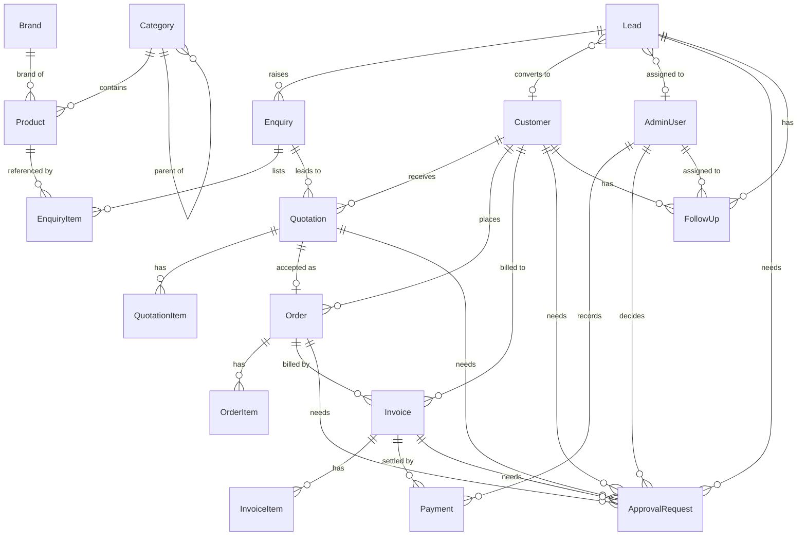

# Architecture

This document explains how the site is put together and — more importantly — **where each future capability plugs in** so Version 1 does not need rewriting.

## 1. Layers

```
 Browser                      Server (Node)
┌───────────────┐   ┌────────────────────────────────────────────────────────────────────┐
│ Pages / RSC   │──▶│ app/(site)/*  pages (Server Components)                            │
│ Forms         │──▶│ app/actions/enquiry.ts   server actions (validate → prepare → save)│
│ Enquiry list  │   └───────────────┬────────────────────────────────────────────────────┘
│ (localStorage)│                   │ depends only on interfaces
└───────────────┘                   ▼
                     lib/services/*          use-cases (e.g. prepareBulkEnquiry)
                     lib/validation/*        zod schemas — the definition of a valid enquiry
                                    │
                                    ▼
                     lib/repositories/types.ts      CatalogueRepository · EnquiryRepository
                                    │
                    ┌───────────────┴────────────────┐
                    ▼                                ▼
       V1 (today)                            Phase 2 (database)
       StaticCatalogueRepository             PrismaCatalogueRepository
       FileEnquiryRepository (.jsonl)        PrismaEnquiryRepository
                                    │
                     lib/repositories/index.ts      ← the ONE place that picks the implementation
```

**The rule that keeps this clean:** pages, server actions, the admin dashboard and (later) the WhatsApp webhook and the AI agent talk to **interfaces** (`CatalogueRepository`, `EnquiryRepository`) and **services**. They never import a data store directly. Swapping the store is a change to one file.

### Why these choices

| Decision | Reason |
| --- | --- |
| **Next.js App Router, TypeScript** | One codebase for the public site, the admin dashboard and the API surface the AI agent / WhatsApp webhook will need. Server Components keep JavaScript small; static generation keeps product pages fast. |
| **Server actions for forms** | No public API endpoint to defend, built-in Origin check, works before JavaScript loads, and no validation library shipped to the browser. (Phase 3 adds route handlers for the WhatsApp webhook — they call the same services.) |
| **Repository interfaces** | The database is a Phase-2 decision; the rest of the app must not care. Also makes the AI agent’s “check the catalogue” tool trivial: it calls `searchProducts()`. |
| **Server-side search via a GET form** | Works without JavaScript, results are server-rendered, every filtered view has a shareable URL, and search/paging scale to a real database. |
| **Tailwind v4 + hand-built components** | ~9 KB of CSS and no component library to ship. Tokens live in `app/globals.css`. |
| **Self-hosted fonts (Inter, Manrope)** | No third-party font requests (faster, private). Licences are in `app/fonts/`. |
| **No map of India** | The “across India” visual is a supply-network diagram. A hand-drawn map risks mis-drawing India’s borders, which is both unprofessional and legally sensitive in India, and a map would imply branches or warehouses the business hasn’t claimed. |
| **Placeholder product images are neutral icon tiles** | No stock photos that misrepresent what the business sells. Replace per product with `imageUrl`. |

## 2. Data model

`prisma/schema.prisma` defines every entity from the brief plus the line-item tables and the approval gate they need. It is **validated** (`npm run db:validate`) but **not connected** — V1 has no database.



Design notes:

- **Prices on `Product` are internal.** `Product` carries `purchasePrice`, `wholesalePrice` and `retailPrice` (all nullable `Decimal(12,2)`) so the owner can keep a price list in the admin — but the **website never shows them**: the public `Product` type has no price field, the public catalogue repository selects only public columns, and a test guards the type. Wholesale prices are still quoted per customer and quantity (`QuotationItem` / `OrderItem` / `InvoiceItem`), and the owner approves every quotation.
- **Brands are their own table** (`Brand`), not products; a product may have no brand. `isListedPublicly` defaults to false, so nothing appears on the website until the owner confirms it. Brand and Category deletes are `Restrict`ed while products use them.
- **Nothing is pre-filled.** SKU, unit, pack size, prices, HSN, GST rate, stock and minimum order quantity are all nullable with no default: NULL means "not entered", never 0. A new product starts as `DRAFT`; `INACTIVE` hides it without deleting it. Add real products from the admin — the repo contains no invented inventory.
- **Supabase.** Tables are reached only from the server (Prisma via `DATABASE_URL`, pooled; migrations via `DIRECT_URL`). Row-level security is switched on for every table with no policies, so the Supabase public API can never read prices; the browser gets no Supabase key. Product images go to Supabase Storage (`SUPABASE_STORAGE_BUCKET`, uploaded server-side with the service-role key), with Cloudinary as a later option behind the same `imageUrl` / `imagePath` fields.
- **No stock figures.** Add an `InventoryItem` model when the business has a stock process. Nothing is invented meanwhile.
- **Lead → Customer.** A *Lead* is anyone who enquired. A *Customer* exists once the business quotes or sells to them; the lead is linked to it on conversion.
- **GST fields are present but empty by default:** `Product.hsnCode`, `Product.gstRatePercent`, per-line `gstRatePercent`, `Invoice.cgstTotal / sgstTotal / igstTotal`, `buyerGstin`, `placeOfSupply`, `irn`. They are filled from the business’s real tax data — never guessed.
- **`ApprovalRequest`** is the owner-approval gate (see [`AI_SALES_AGENT.md`](AI_SALES_AGENT.md)). Its `ApprovalAction` enum mirrors the `OWNER_APPROVAL` entries of `lib/ai-sales/policy.ts`, and its `ApprovalStatus` / `AdminRole` enums and target foreign keys mirror the policy’s lists; tests fail if any of them drift apart. It stores everything `canExecute` checks: the target record (one foreign key per record type), the mandatory `payload` and its `payloadHash`, a mandatory `expiresAt`, `executedAt` for single use, and `decidedByRole` — the approver’s role snapshotted at the moment of decision. `QuotationItem` records who set each price (`priceSetBy`) and the approval that covers an agent-set one.
- **History is protected from deletion.** Relations to Lead, Customer, Enquiry, Quotation, Order and Invoice — and to the staff member who decided an approval or recorded a payment — are `onDelete: Restrict`; only line items cascade from their own parent. “Removing” something means a status (`LOST`, `SPAM`, `CANCELLED`, `VOID`), deactivating an admin user, or anonymising personal data in place. (Otherwise deleting a quotation would also delete the only proof the owner approved sending it, and deleting an issued invoice would leave a hole in the GST series.) `Restrict` guards a *parent*; a leaf row such as a `Payment` or an `ApprovalRequest` could still be deleted directly, so the first migration also revokes `DELETE` on the evidence tables (or adds a trigger that refuses it). `tests/schema.test.ts` guards the schema side; the header of `prisma/schema.prisma` lists the migration rules.
- **No default actor.** `createdBy` / `requestedBy` have no default, so a code path that forgets to say who acted fails rather than being recorded as a person (or as the agent).
- **Invoice numbers** carry the financial year and sequence behind them (`financialYear`, `sequence`, unique together), allocated from `NumberSequence` with one upsert at issue time.
- **A draft can be unpriced.** Quotation line prices, GST rate and totals are nullable — `NULL` means “not priced yet”, never `0`. Order and invoice lines are not nullable: those values are final.
- **GST invoices.** `Invoice.number` is `NULL` until the invoice is *issued* and is then allocated from `NumberSequence` (one row per series per financial year, e.g. `INV` / `2026-27`) inside the same transaction, so drafts never burn numbers and a rollback leaves no gap. Buyer and supplier name, address and GSTIN are **snapshotted onto the invoice** at issue time, so later edits to a Customer cannot change an invoice that has already been sent.
- **Rules Prisma cannot express** are listed at the top of `schema.prisma` for the first migration: exactly one approval target set (CHECK), one pending approval per target (partial unique index), no quotation leaving DRAFT with an unpriced line.
- Quotations, orders, invoices, follow-ups and approval requests record **who created them** (`ActorType`: `ADMIN`, `AI_AGENT`, `CUSTOMER`, `SYSTEM`) so AI work is always attributable; enquiries and leads record the channel they came from (`source`), and payments record the staff member who entered them.

### Connecting the database (Phase 2 checklist)

> **Status:** the first migration (`prisma/migrations/0001_init`) is written and tested but **not run**. Read [`MIGRATION_0001_REVIEW.md`](MIGRATION_0001_REVIEW.md) first; it lists every table, relationship, row-level-security rule and risk, and needs the owner's approval before it is applied to Supabase.


1. Provision PostgreSQL (Neon, Supabase, Railway, RDS…); set `DATABASE_URL`.
2. `npm i @prisma/client`, add `@prisma/adapter-pg` per the Prisma 7 docs, `npx prisma migrate dev --name init`.
3. Implement `PrismaCatalogueRepository` and `PrismaEnquiryRepository` against the interfaces in `lib/repositories/types.ts`. The enquiry implementation upserts a `Lead` by phone, then creates the `Enquiry` and its `EnquiryItem`s in one transaction.
4. **Done in code:** `lib/repositories/index.ts` returns `PrismaEnquiryRepository` whenever `DATABASE_URL` is set, and `PrismaCatalogueRepository` when `CATALOGUE_SOURCE=database`. Both use `lib/db/client.ts` (server-only, pooled `pg` connection, tiny pool per serverless instance). The catalogue queries use explicit `select`s of public columns only — prices, SKU, stock, HSN and GST can never reach a page — and tests (against a real PostgreSQL) enforce it. Public pages re-generate every 5 minutes (`revalidate = 300`), so product edits appear without a redeploy.
5. `npm run db:seed` (dry run first) loads the owner-supplied categories, brands and five products (`data/`) into the database — create-only, never overwriting. Any enquiries already in `.data/enquiries.jsonl` would need a one-off import; none exist yet.
6. Replace `StorageUnavailableError` handling only if you want different wording — the WhatsApp fallback already works for any store failure.

No page or component changes were required.

## 3. The enquiry flow

```
Visitor taps "Add to Enquiry" ──▶ localStorage list (lib/client/enquiry-list.ts)
        │
        ▼
/request-quote  or  /bulk-orders  or  /contact
        │  <form action={serverAction}>
        ▼
app/actions/enquiry.ts
   1. readItems / readValues (FormData)
   2. zod safeParse            ── invalid ─▶ field errors + submitted values (form is re-filled)
   3. honeypot filled?         ── yes ─────▶ silent "success", nothing stored
   4. prepareBulkEnquiry       resolves list items against the catalogue (unknown slugs dropped)
   5. EnquiryRepository.create  (8 s timeout — a hung store must not mean an endless spinner)
        ├─ ok ─────────────────▶ success panel: reference + "send on WhatsApp too"
        └─ StorageUnavailable ─▶ error panel + WhatsApp fallback with the enquiry pre-written
```

Later channels (WhatsApp webhook, AI agent, phone entry in the admin) call the **same** preparation/repository functions, so every enquiry lands in one pipeline regardless of where it came from (`EnquirySource`).

## 4. Admin foundation

- Routes: `app/admin` (dashboard) and `app/admin/[section]` for the 14 sections in `lib/admin/sections.ts`. Each section page states what it will manage, which entities it uses and what it needs first — **no fake data or buttons**.
- Access: `proxy.ts` rewrites every `/admin/*` request to a 404 in production, and `requireAdmin()` (`lib/auth/guard.ts`) does the same inside the app. In development a labelled preview session lets the shell be reviewed. Admin responses are `noindex` and `no-store`.
- **Phase 2:** implement `requireAdmin()` against a real session (Auth.js or signed-cookie sessions with `AUTH_SECRET`, backed by `AdminUser`), let `proxy.ts` pass requests that carry a session cookie, and make **every admin data function call `requireAdmin()` / `requireOwner()` itself** — a layout check is not enough because layouts do not re-render on client-side navigation.

## 5. Environment variables

All declared in `lib/env.ts` (zod, `server-only`) and documented in `.env.example`. Only `NEXT_PUBLIC_SITE_URL` is public. Secrets are optional in V1 because nothing consumes them yet; make a variable required in the same change that adds the feature using it.

## 6. SEO

- Title/description/canonical/OG/Twitter per page via `pageMetadata()` (`lib/seo.ts`). A page-level `openGraph` replaces the layout’s, so the share image is repeated there — a test guards this.
- Structured data: Organization (only supplied facts), WebSite + SearchAction, BreadcrumbList on product/category pages, FAQPage on Bulk Orders. **No Product/Offer markup** — there are no prices to mark up.
- Search-result and filtered `/products` URLs are `noindex`; category pages (`/categories/pens`…) are the indexable landing pages for “school stationery wholesale”, “engineering stationery supplier”, etc.
- `sitemap.xml` is generated from the catalogue repository, so new products and categories appear automatically.
- Unknown product/category URLs return a real **404** (checked by `npm run smoke`).

## 7. Performance & accessibility

- Static generation for content pages; `/products` and `/request-quote` render on request because they depend on query strings.
- Measured (production build, mobile viewport): HTML 16–29 KB, CSS 9 KB, fonts 71 KB (two latin variable fonts), JS ≈ 142–148 KB gzipped on every page, which is almost entirely the React + Next runtime. Interactive pieces are small client islands: nav highlighting, mobile menu, enquiry list, forms.
- Scroll-reveal uses CSS scroll-driven animations with `@supports`, so unsupported browsers simply show the content; `prefers-reduced-motion` disables motion.
- axe-core (WCAG 2.2 AA + best-practice rules): 0 violations on 10 pages × desktop/mobile. Forms use real labels, `aria-invalid`/`aria-describedby`, focus the error/success panel, and scroll it into view.

## 8. Testing

| Layer | Tooling | Where |
| --- | --- | --- |
| Unit | Vitest | `tests/` — phone/WhatsApp, validation, catalogue search, enquiry actions end-to-end with a temp store, file store, AI policy & workflow, SEO helpers, admin guard, env, **content-integrity guard** (fails on invented prices, stats, testimonials, certifications, delivery promises) |
| Schema | `prisma validate` | `npm run db:validate` |
| Runtime | Smoke script | `npm run smoke` — catches errors in request-time routes that a build cannot |

Add a Playwright suite when the admin and AI features land; the manual run used for V1 covered search → enquiry list → validation → submit → persisted record → honeypot → mobile bar.
